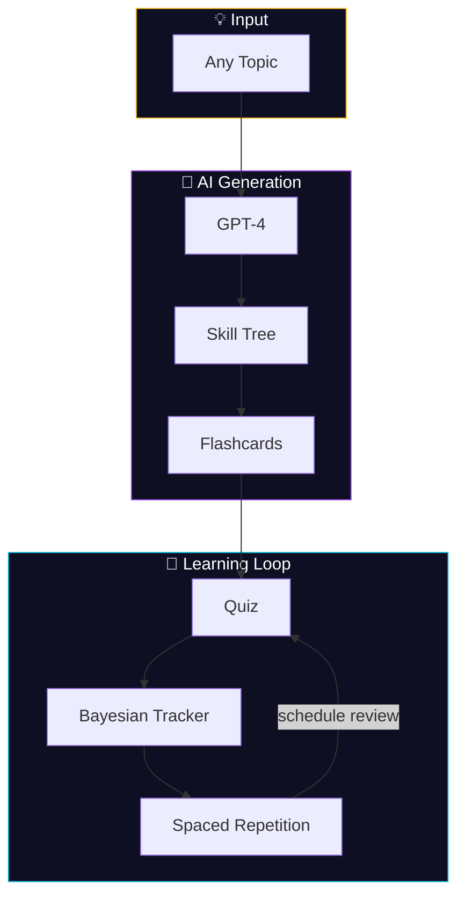

<div align="center">
  
  <p><strong>AI-powered course builder that transforms any topic into gamified, Duolingo-style micro-learning with spaced repetition.</strong></p>
  <p>
    <a href="https://courseai-beta.vercel.app"><strong>🚀 Live Demo</strong></a>
  </p>
</div>

# Course Builder

**AI-powered course generator that transforms any topic into gamified, Duolingo-style micro-learning with spaced repetition and learning science.**

Turn "Machine Learning" or "Spanish Cooking" into a complete learning course in minutes. Our AI pipeline automatically generates structured flashcards, quizzes, and skill progressions, then uses Bayesian knowledge tracking and spaced repetition to optimize your retention. No manual course creation required.

## What It Does

- **🤖 AI Course Generation**: Input any topic → Get a complete course with cards, quizzes, and skill trees
- **🧠 Learning Science**: Bayesian knowledge tracking, spaced repetition (SuperMemo 2), and forgetting curve modeling
- **🎮 Gamification**: XP system, achievements, daily streaks, and mastery levels (Novice → Expert)
- **📊 Analytics Dashboard**: Track progress, skill mastery probability, and learning patterns
- **🔄 Smart Review Mode**: AI prioritizes content you're about to forget across all courses

## Quick Start

### Prerequisites
- Node.js 18+
- Supabase account (free tier)
- OpenAI API key

### Setup

1. **Clone and install**
```bash
git clone https://github.com/rohunvora/coursebuilder.git
cd coursebuilder
npm install
```

2. **Configure environment**
```bash
cp .env.example .env.local
```

Add your keys to `.env.local`:
```env
OPENAI_API_KEY=your_openai_key
NEXT_PUBLIC_SUPABASE_URL=your_supabase_url
NEXT_PUBLIC_SUPABASE_ANON_KEY=your_supabase_key
DATABASE_URL=your_database_url
```

3. **Setup database**
```bash
npm run setup-db
npx prisma db push
```

4. **Start development**
```bash
npm run dev
```

Visit `http://localhost:3000` and create your first course!

## How It Works



### Course Generation Pipeline
1. **Topic Input**: Enter any subject (e.g., "React Hooks", "Italian Renaissance")
2. **AI Processing**: GPT-4 generates structured learning content with difficulty progression
3. **Skill Mapping**: Creates interconnected skills following Bloom's taxonomy
4. **Card Generation**: Produces flashcards, multiple choice, and scenario-based questions

### Learning Science Features
- **Bayesian Knowledge Tracking**: Models your understanding probability for each skill
- **Spaced Repetition**: Schedules reviews using SuperMemo 2 algorithm
- **Confidence Calibration**: Rate confidence before answers to improve self-assessment
- **Response Time Analysis**: Faster correct answers boost retention estimates

## Tech Stack

- **Frontend**: Next.js 14, TypeScript, Tailwind CSS
- **Backend**: Prisma ORM, SQLite/PostgreSQL
- **AI**: OpenAI GPT-4 API
- **Database**: Supabase (production) or local SQLite
- **Deployment**: Vercel-ready

## Project Status

This is a learning science research project turned into a functional prototype. The AI course generation pipeline is the core innovation - everything else builds on established learning platform patterns.

**What works well:**
- Course generation from arbitrary topics
- Learning science algorithms (spaced repetition, knowledge tracking)
- Basic gamification and progress tracking

**What's experimental:**
- AI-generated content quality varies by topic complexity
- Analytics dashboard is functional but could be more sophisticated
- Achievement system is basic but extensible

## Documentation

- [Deployment Guide](DEPLOYMENT.md)
- [Supabase Setup](SUPABASE-SETUP.md)
- [Debug Guide](DEBUG_GUIDE.md)
- [Directory Structure](DIRECTORY-MAP.md)

## Contributing

This project welcomes contributions, especially in:
- Improving AI prompt engineering for course generation
- Enhancing learning science algorithms
- Adding new gamification features
- Better analytics and visualization

## License

MIT License - see LICENSE file for details.